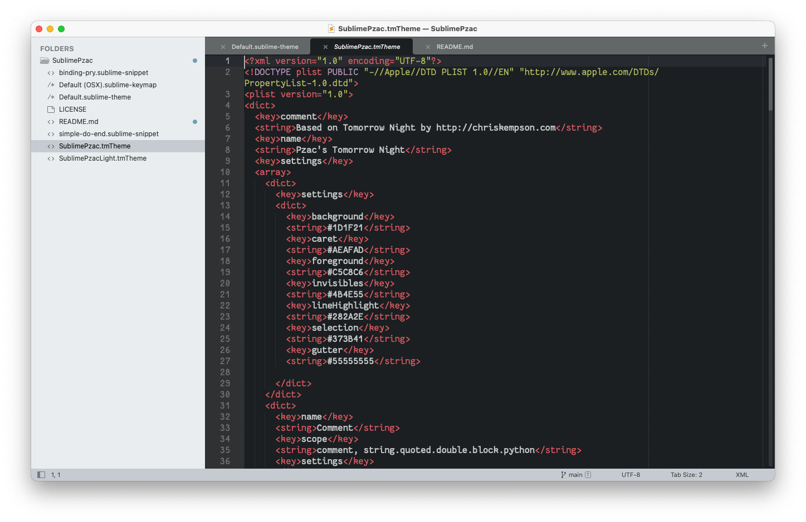
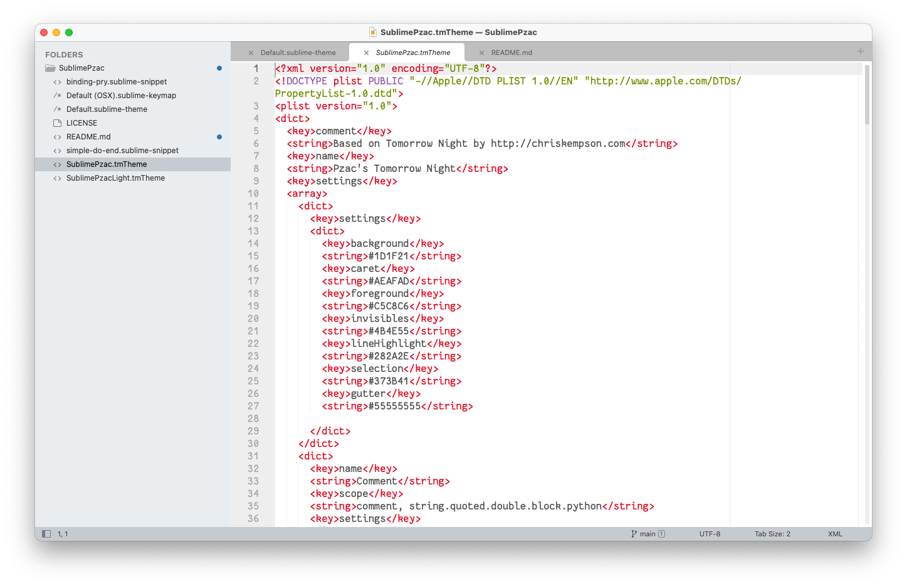

## SublimePzac

This package contains the stuff I use with Sublime Text

### Content

- A couple of themes (SublimePzac and SublimePzacLight) that tweak the wonderful Tomorrow-Night and Tomorrow by changing the gutter background color
- Some overrides of the default theme to tweak the sidebar
- A `bp[tab]` snippet that expands to `binding.pry` in ruby source files.
- A `do[tab]` snippet that overrides the built-in Ruby package. It's simpler and works better for me

### Install

If you really want to use this, open the Sublime Text Packages folder

- OS X: ~/Library/Application Support/Sublime Text/Packages/
- Windows: %APPDATA%/Sublime Text 3/Packages/
- Linux: ~/.Sublime Text 3/Packages/ or ~/.config/sublime-text-3/Packages

and clone this repo

### Screenshots

